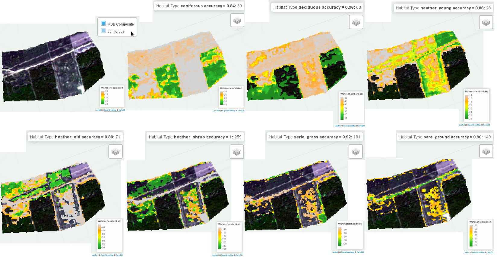
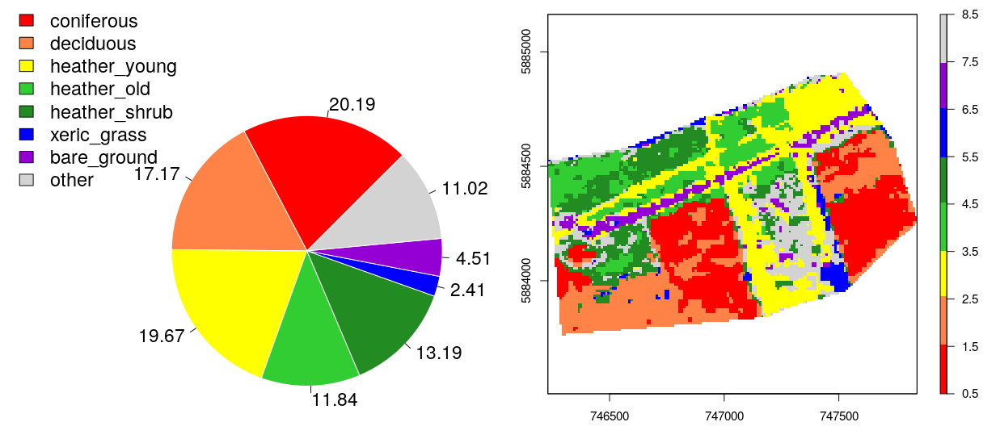

==================================================================================================
Procedure on Autonomous Sampling and Reductive Learning in Imagery
==================================================================================================

How to use
----------------
* You need R to run the master script: **HabitatSampler_v02.r**
* Within the master script a step by step procedure is executed: **HabitatSampler_Usage.txt** 
* This is the routine: `HabitatSampler_v2.0 <https://github.com/carstennh/HabitatSampler/tree/master/HabitatSampler_v2.0>`__

Input
----------------
* **Image File as Raster Layer Stack** (e.g. Satellite Time Series, RGB Drone, Orthophoto)
* **Reference File** (e.g. spectral-temporal profiles or point shape; one profile or point per category)
* **Class Names** (the categories that are defined to be delineated in imagery)

Output
----------------
* **Interactive Maps** of habitat type probailities

           
* **Classified Image** of chosen categories
* **Sample Distribution** of sampled categories
* **Spatial Statistics** of categories distribution
* the categories are refferred to as habitat types

Key Features
----------------
* the algorithm provides a set of **reference samples** for each habitat type
* the algorithm provides an ensemble of calibrated **machine learning classifiers** for each habitat type
* the algorithm provides a map of **habitat type probabilities** 
* the algorithm is optimzed for broad-scale **satellite image** time series (pixel size > 10m)
* the alogrthm can be applied on **variable image categories** in complex scenes
* the algorithm is tranferable to **variable input imagery** 

Credits
----------------

HaSa was developed by Carsten Neumann (Helmholtz Centre Potsdam GFZ German Research Centre for Geosciences) within the context of the
`NaTec - KRH <http://www.heather-conservation-technology.com/>`__ project funded by the German Federal Ministry of Education and Research (BMBF) (grant number: 01 LC 1602A).

The test data represent pre-processed Copernicus Sentinel-2 satellite imagery (ESA 2018). Pre-processing was done using GTS2 and AROSICS. 

